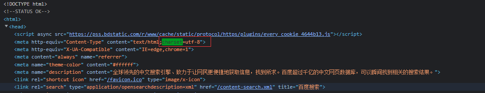
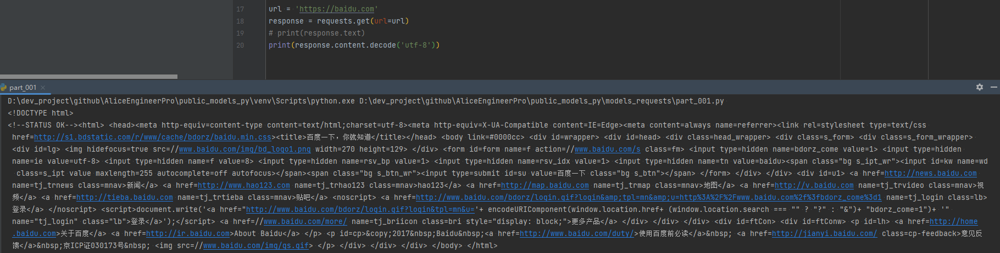
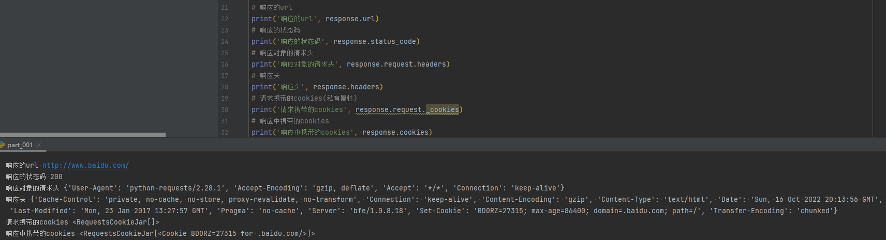

# response响应对象

> 观察上边代码运行结果发现，有好多乱码；这是因为编解码使用的字符集不同早造成的；我们尝试使用下边的办法来解决中文乱码问题

```python
# coding: utf8
""" 
@File: part_001.py
@Author: Alice(From Chengdu.China)
@HomePage: https://github.com/AliceEngineerPro
@CreatedTime: 2022/10/17 2:25
"""

import os, sys

"""初识requests模块和简单的response对象"""

# 导入requests模块
import requests 

# 目标url
url = 'https://www.baidu.com' 
# 向目标url发送get请求
response = requests.get(url)
# 打印响应内容
# print(response.text)
print(response.content.decode())  # 注意这里
```

1. response.text是requests模块按照chardet模块推测出的编码字符集进行解码的结果
2. 网络传输的字符串都是bytes类型的,所以response.text=response.content.decode('推测出的编码字符集')
3. 我们可以在网页源码中搜索`charset`,尝试参考该编码字符集，注意存在不准确的情况

## 一. response.text和response.content的区别

- response.text
  - type: str
  - decode: requests模块自动根据HTTP头部对响应的编码作出有根据的推测，推测的文本编码
- response.content
  - type: bytes
  - decode: None

## 二. 通过对response.content使用decode()方法, 来解决中文乱码

 

```python
# coding: utf8
""" 
@File: part_001.py
@Author: Alice(From Chengdu.China)
@HomePage: https://github.com/AliceEngineerPro
@CreatedTime: 2022/10/17 2:25
"""

import os, sys

"""初识requests模块和简单的response对象"""

import requests

url = 'https://baidu.com'
response = requests.get(url=url)
# print(response.text)
# print(response.content.decode('utf-8'))
print(response.content.decode())  # 默认是utf-8
```

 

- 常见的编码字符集
  - utf-8
  - gbk
  - gb2312
  - ascii
  - iso-8859-1

## 三. response响应对象的其它常用属性或方法

> `response = requests.get(url)` response是发送请求获取的响应对象

1.  `response.url` 响应的url, 有时候响应的url和请求的url并不一致
2.  `response.status_code` 响应状态码
3.  `response.request.headers` 响应对应的请求头
4.  `response.headers` 响应头
5.  `response.request._cookies` 响应对应请求的cookie, 返回RequestsCookieJar对象类型
6.  `response.cookies` 响应的cookie, 经过了set-cookie动作, 返回RequestsCookieJar对象类型
7.  `response.json` 自动将json字符串类型的响应内容转换为python对象 -> dict or list

```python
# coding: utf8
""" 
@File: part_001.py
@Author: Alice(From Chengdu.China)
@HomePage: https://github.com/AliceEngineerPro
@CreatedTime: 2022/10/17 2:25
"""

import os, sys

"""初识requests模块和简单的response对象"""

import requests

url = 'https://baidu.com'
response = requests.get(url=url)
# print(response.text)
print(response.content.decode('utf-8'))
# 响应的url
print('响应的url', response.url)
# 响应的状态码
print('响应的状态码', response.status_code)
# 响应对象的请求头
print('响应对象的请求头', response.request.headers)
# 响应头
print('响应头', response.headers)
# 请求携带的cookies(私有属性)
print('请求携带的cookies', response.request._cookies)
# 响应中携带的cookies
print('响应中携带的cookies', response.cookies)
```

 


