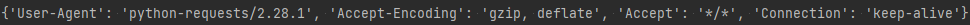
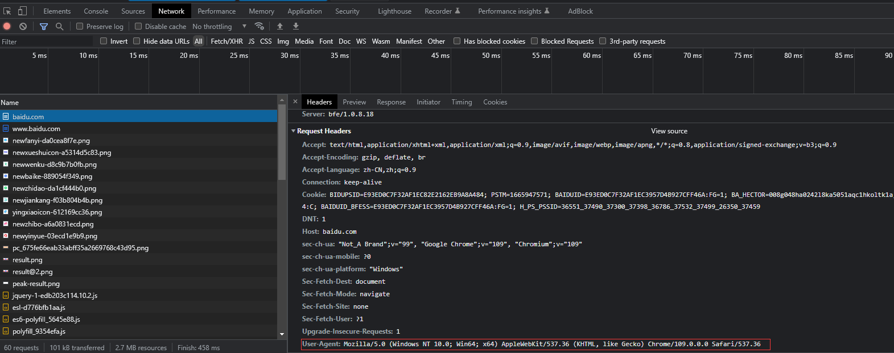
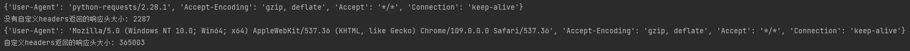
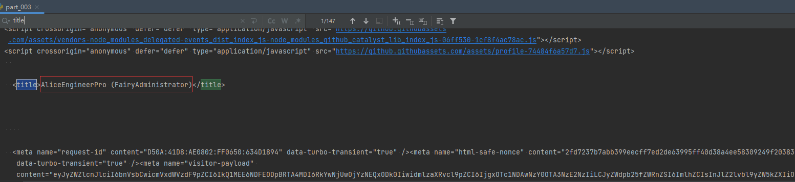

# requests模块发送GET请求

## 一. 发送带header的请求

> 我们先写一个获取百度首页的代码

```python
# coding: utf8
""" 
@File: part_002.py
@Author: Alice(From Chengdu.China)
@HomePage: https://github.com/AliceEngineerPro
@CreatedTime: 2022/10/17 15:26
"""

import os, sys

"""requests发送请求"""

import requests

url = 'https://baidu.com'
response = requests.get(url=url)
# print(response.content.decode())
# 打印响应对应请求的请求头信息
print(response.request.headers)
```

返回的请求头

 

### 1. 思考

1. 对比浏览器上百度首页的网页源码和代码中的百度首页的源码, 有什么不同?

   - 查看网页源码的方法:`右键`->`查看网页源代码` 

1. 代码中的百度首页的源码非常少,为什么?

   - 需要我们带上请求头信息

     > 模拟浏览器,欺骗服务器,获取和浏览器一致的内容

   - 请求头中有很多字段,其中User-Agent字段必不可少,表示客户端的操作系统以及浏览器的信息

### 2. 携带请求头发送请求的方法

`requests.get(url=url, headers=headers)`

- headers参数接收字典形式的请求头
- 请求头字段名作为key,字段对应的值作为value

### 3. 完成代码实现

> 从浏览器中复制User-Agent,构造headers字典;完成下面的代码后,运行代码查看结果 

  

```python
# coding: utf8
""" 
@File: part_002.py
@Author: Alice(From Chengdu.China)
@HomePage: https://github.com/AliceEngineerPro
@CreatedTime: 2022/10/17 15:26
"""

import os, sys

"""requests发送请求"""

import requests

url = 'https://baidu.com'
response = requests.get(url=url)
# print(response.content.decode())
# 打印响应对应请求的请求头信息
print(response.request.headers)

"""发送带headers的请求"""

# 定义请求头
headers = {
    'User-Agent': 'Mozilla/5.0 (Windows NT 10.0; Win64; x64) AppleWebKit/537.36 (KHTML, like Gecko) Chrome/109.0.0.0 Safari/537.36'
}

# 在请求头中带上User-Agent, 模拟浏览器发送请求
response = requests.get(url=url, headers=headers)
# 打印请求头
print(response.request.headers)
```

 

## 二. requests模块发送带参数的请求

> 我们在使用百度搜索的时候经常发现url地址中会有一个`?`,那么该问号后边的就是请求参数,又叫做查询字符串

### 1. 在url携带参数

直接对含有参数的url发起请求 

```python
# coding: utf8
""" 
@File: part_002.py
@Author: Alice(From Chengdu.China)
@HomePage: https://github.com/AliceEngineerPro
@CreatedTime: 2022/10/17 15:26
"""

import os, sys

"""requests发送请求"""

import requests

url = 'https://baidu.com'
response = requests.get(url=url)
# print(response.content.decode())
# 打印响应对应请求的请求头信息
print(response.request.headers)
print(f'没有自定义headers返回的响应头大小: {len(response.content.decode())}')

"""发送带headers的请求"""

# 定义请求头
headers = {
    'User-Agent': 'Mozilla/5.0 (Windows NT 10.0; Win64; x64) AppleWebKit/537.36 (KHTML, like Gecko) Chrome/109.0.0.0 Safari/537.36'
}

# 在请求头中带上User-Agent, 模拟浏览器发送请求
response = requests.get(url=url, headers=headers)
# 打印请求头
print(response.request.headers)
print(f'自定义headers返回的响应头大小: {len(response.content.decode())}')

"""发送带参数的请求"""

url = 'https://baidu.com/s?wd=python'
response = requests.get(url=url, headers=headers)
```

### 2. 通过params携带参数字典

1. 构建请求参数字典
1. 向接口发送请求的时候带上参数字典,参数字典设置给params

```python
# coding: utf8
""" 
@File: part_002.py
@Author: Alice(From Chengdu.China)
@HomePage: https://github.com/AliceEngineerPro
@CreatedTime: 2022/10/17 15:26
"""

import os, sys

"""requests发送请求"""

import requests

url = 'https://baidu.com'
response = requests.get(url=url)
# print(response.content.decode())
# 打印响应对应请求的请求头信息
print(response.request.headers)
print(f'没有自定义headers返回的响应头大小: {len(response.content.decode())}')

"""发送带headers的请求"""

# 定义请求头
headers = {
    'User-Agent': 'Mozilla/5.0 (Windows NT 10.0; Win64; x64) AppleWebKit/537.36 (KHTML, like Gecko) Chrome/109.0.0.0 Safari/537.36'
}

# 在请求头中带上User-Agent, 模拟浏览器发送请求
response = requests.get(url=url, headers=headers)
# 打印请求头
print(response.request.headers)
print(f'自定义headers返回的响应头大小: {len(response.content.decode())}')

"""发送带参数的请求"""

url = 'https://baidu.com/s'
# url = 'https://baidu.com/s?wd=python'
# response = requests.get(url=url, headers=headers)

# 请求参数是一个字典 即wd=python
params = {
    'wd': 'python'
}
# 带上请求参数发起请求,获取响应
response = requests.get(url=url, headers=headers, params=params)
```

## 三. 在headers参数中携带cookie

> 网站经常利用请求头中的Cookie字段来做用户访问状态的保持,那么我们可以在headers参数中添加Cookie,模拟普通用户的请求,我以github登陆为例

### 1. github登陆抓包分析

1. 打开浏览器,`右键`->`检查`,点击`Network`,勾选`Preserve log` 
1. 访问github登陆的url地址<https://github.com/login> 
1. 输入账号密码点击登陆后,访问一个需要登陆后才能获取正确内容的url;访问<https://github.com/{USERNAME}> 
1. 确定url之后, 再确定发送该请求所需要的请求头信息中的`User-Agent`和`Cookie` 

 

### 2. 代码完成

- 从浏览器中复制`User-Agent`和`Cookie` 
- 浏览器中的请求头字段和值与headers参数中必须一致
- headers请求参数字典中的Cookie键对应的值是字符串

```python
# coding: utf8
""" 
@File: part_003.py
@Author: Alice(From Chengdu.China)
@HomePage: https://github.com/AliceEngineerPro
@CreatedTime: 2022/10/17 16:10
"""

import os, sys

"""在headers参数中携带cookie"""

"""github示例"""

import requests

url = 'https://github.com/AliceEngineerPro'
# url = 'https://github.com/{USERNAME}'

# 构造请求头字典
headers = {
    # 从浏览器中复制过来的User-Agent
    'User-Agent': 'Mozilla/5.0 (Windows NT 10.0; Win64; x64) AppleWebKit/537.36 (KHTML, like Gecko) Chrome/109.0.0.0 Safari/537.36',
    # 从浏览器中复制过来的Cookie
    'Cookie': 'cookie字符串'
}

# 请求头参数字典中携带cookie字符串
response = requests.get(url, headers=headers, proxies={'http': 'http://127.0.0.1:56789'})
print(response.content.decode())
```

### 3. 运行代码验证结果

> 在打印的输出结果中搜索title,html中的标题文本内容如果是你的github账号,则成功利用headers参数携带cookie,获取登陆后才能访问的页面

 

## 四. cookies参数的使用

> 上一小节我们在headers参数中携带cookie,也可以使用专门的cookies参数

### 1. cookies参数的形式

dict `cookies={'name'='value'}`

- 该字典对应请求头中Cookie字符串,以分号,空格分割每一对字典键值对
- 等号左边的是一个cookie的name,对应cookies字典的key
- 等号右边对应cookies字典的value

### 2. cookies参数的使用方法

```python
response = requests.get(url, cookies)
```

### 3. 将cookie字符串转换为cookies参数所需的字典

```python
cookies_dict = {cookie.split('=')[0]:cookie.split('=')[1] for cookie in cookies_str.split('; ')}
```

- 注意: **cookie一般是有过期时间的,一旦过期需要重新获取** 

```python
# coding: utf8
""" 
@File: part_003.py
@Author: Alice(From Chengdu.China)
@HomePage: https://github.com/AliceEngineerPro
@CreatedTime: 2022/10/17 16:10
"""

import os, sys

"""在headers参数中携带cookie"""

import requests

"""github示例"""

url = 'https://github.com/AliceEngineerPro'
# url = 'https://github.com/{USERNAME}'

# 构造请求头字典
headers = {
    # 从浏览器中复制过来的User-Agent
    'User-Agent': 'Mozilla/5.0 (Windows NT 10.0; Win64; x64) AppleWebKit/537.36 (KHTML, like Gecko) Chrome/109.0.0.0 Safari/537.36',
    # 从浏览器中复制过来的Cookie
    # 'Cookie': 'cookie字符串'
}

# 请求头参数字典中携带cookie字符串
# response = requests.get(url, headers=headers, proxies={'http': 'http://127.0.0.1:56789'})
# print(response.content.decode())

"""cookies参数的使用"""

# 构建cookie字典 -> 字典推导式
cookie_temp = 'cookie字符串(cookies values)'

# 普通方法
# cookie_temp_list = cookie_temp.split('; ')
# cookies = {}
# for cookie in cookie_temp_list:
#     cookies[cookie.split('=')[0]]=cookie.split('=')[1]
# 字典推导式
cookies = {cookie.split('=')[0]: cookie.split('=')[1] for cookie in cookie_temp.split('; ')}
response = requests.get(url=url, headers=headers, cookies=cookies, proxies={'http': 'http://127.0.0.1:56789', 'https': 'http://127.0.0.1:56789'})
with open(file='./github_with.html', mode='wb') as files:
    files.write(response.content)
files.close()
```

## 五. RequestCookieJar对象转换为cookies字典的方法

> 使用requests获取的resposne对象,具有cookies属性.该属性值是一个RequestCookieJar类型,包含了对方服务器设置在本地的cookie.我们如何将其转换为cookies字典呢?

### 1. 转换方法

```python
cookies_dict = requests.utils.dict_from_cookiejar(response.cookies)
```

其中response.cookies返回的就是cookieJar类型的对象

`requests.utils.dict_from_cookiejar` 方法返回cookies字典

```python
import requests
from requests import utils

"""RequestCookieJar对象转换为cookies字典的方法"""

url_baidu = 'https://baidu.com'
response = requests.get(url=url)
print(requests.utils.dict_from_cookiejar(response.cookies))
```

## 六. 超时参数timeout的使用

> 在平时网上冲浪的过程中,我们经常会遇到网络波动,这个时候,一个请求等了很久可能任然没有结果.
>
> 在爬虫中,一个请求很久没有结果,就会让整个项目的效率变得非常低,这个时候我们就需要对请求进行强制要求,让他必须在特定的时间内返回结果,否则就报错.

### 1. 超时参数timeout的使用方法

```python
response = requests.get(url, timeout=3)
```

timeout=3表示:发送请求后,3秒钟内返回响应,否则就抛出异常

```python
# coding: utf8
""" 
@File: part_004.py
@Author: Alice(From Chengdu.China)
@HomePage: https://github.com/AliceEngineerPro
@CreatedTime: 2022/10/18 2:47
"""

import os, sys

"""超时timeout参数和proxies的使用"""

import requests

url = 'https://twitter.com'

try:
    response = requests.get(url=url, timeout=3)
    print('第一次请求', response.status_code)
except Exception as error:
    print('第一次请求', error)
finally:
    proxy = {
        'http': 'http://127.0.0.1:56789',
        'https': 'http://127.0.0.1:56789',
    }
    try:
        response = requests.get(url=url, timeout=3, proxies=proxy)
        print('第二次请求', response.status_code)
    except Exception as error:
        print('第二次请求', error)
```

## 七. 了解代理以及proxy代理参数的使用

> proxy代理参数通过指定代理ip,让代理ip对应的正向代理服务器转发我们发送的请求,那么我们首先来了解一下代理ip以及代理服务器

### 1. 理解使用代理的过程

1. 代理ip是一个ip,指向的是一个代理服务器
2. 代理服务器能够帮我们向目标服务器转发请求

 

### 2. 正向代理和反向代理的区别

> 前边提到proxy参数指定的代理ip指向的是正向的代理服务器,那么相应的就有反向服务器;现在来了解一下正向代理服务器和反向代理服务器的区别

1. 从发送请求的一方的角度,来区分正向或反向代理
2. 为浏览器或客户端(发送请求的一方)转发请求的,叫做正向代理
   - 浏览器知道最终处理请求的服务器的真实ip地址,例如VPN
3. 不为浏览器或客户端(发送请求的一方)转发请求,而是为最终处理请求的服务器转发请求的,叫做反向代理
   - 浏览器不知道服务器的真实地址,例如nginx

### 3. 代理ip(代理服务器)的分类

1. 根据代理ip的匿名程度,代理IP可以分为下面三类

   1. 透明代理(Transparent Proxy):透明代理虽然可以直接“隐藏”你的IP地址,但是还是可以查到你是谁.目标服务器接收到的请求头如下

      ```shell
      REMOTE_ADDR = Proxy IP
      HTTP_VIA = Proxy IP
      HTTP_X_FORWARDED_FOR = Your IP
      ```

   2. 匿名代理(Anonymous Proxy):使用匿名代理,别人只能知道你用了代理,无法知道你是谁.目标服务器接收到的请求头如下

      ```shell
      REMOTE_ADDR = proxy IP
      HTTP_VIA = proxy IP
      HTTP_X_FORWARDED_FOR = proxy IP
      ```

   3. 高匿代理(Elite proxy或High Anonymity Proxy):高匿代理让别人根本无法发现你是在用代理,所以是最好的选择.毫无疑问使用高匿代理效果最好.目标服务器接收到的请求头如下

      ```shell
      REMOTE_ADDR = Proxy IP
      HTTP_VIA = not determined
      HTTP_X_FORWARDED_FOR = not determined
      ```

2. 根据网站所使用的协议不同,需要使用相应协议的代理服务.从代理服务请求使用的协议可以分为

   - http代理:目标url为http协议
   - https代理:目标url为https协议
   - socks隧道代理(例如socks5代理)等
     - socks代理只是简单地传递数据包,不关心是何种应用协议(FTP,HTTP和HTTPS等).
     - socks代理比http,https代理耗时少.
     - socks代理可以转发http和https的请求

### 4. proxies代理参数的使用

> 为了让服务器以为不是同一个客户端在请求;为了防止频繁向一个域名发送请求被封ip,所以我们需要使用代理ip

proxies代理参数的用法

```python
response = requests.get(url, proxies=proxies)
```

- proxies的形式:字典

e.g.

```python
proxies = { 
    "http": "http://127.0.0.1:56789", 
    "https": "http://127.0.0.1:56789", 
}
```

- **注意:如果proxies字典中包含有多个键值对,发送请求时将按照url地址的协议来选择使用相应的代理ip** 

```python
# coding: utf8
""" 
@File: part_004.py
@Author: Alice(From Chengdu.China)
@HomePage: https://github.com/AliceEngineerPro
@CreatedTime: 2022/10/18 2:47
"""

import os, sys

"""超时timeout参数和proxies的使用"""

import requests

url = 'https://twitter.com'

try:
    response = requests.get(url=url, timeout=3)
    print('第一次请求', response.status_code)
except Exception as error:
    print('第一次请求', error)
finally:
    proxy = {
        'http': 'http://127.0.0.1:56789',
        'https': 'http://127.0.0.1:56789',
    }
    try:
        response = requests.get(url=url, timeout=3, proxies=proxy)
        print('第二次请求', response.status_code)
    except Exception as error:
        print('第二次请求', error)
```

## 八. 使用verify参数忽略CA证书

> 在使用浏览器上网的时候,有时能够看到下面的提示(2018年10月之前的12306网站)

 

- 原因:该网站的CA证书没有经过【受信任的根证书颁发机构】的认证

### 1. 向不安全的链接发起请求

如果代码抛出包含`ssl.CertificateError...`字样的异常

### 2. 解决方案

> 为了在代码中能够正常的请求,我们使用`verify=False`参数,此时requests模块发送请求将不做CA证书的验证:verify参数能够忽略CA证书的认证

```python
import requests
url = "url" 
response = requests.get(url,verify=False)
```

