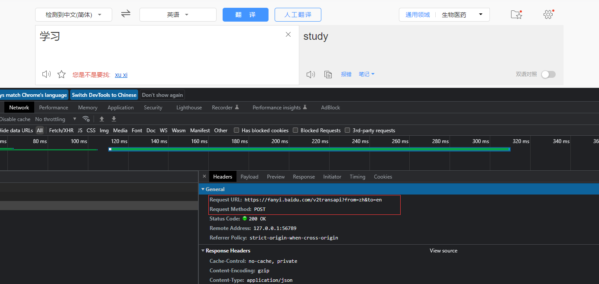
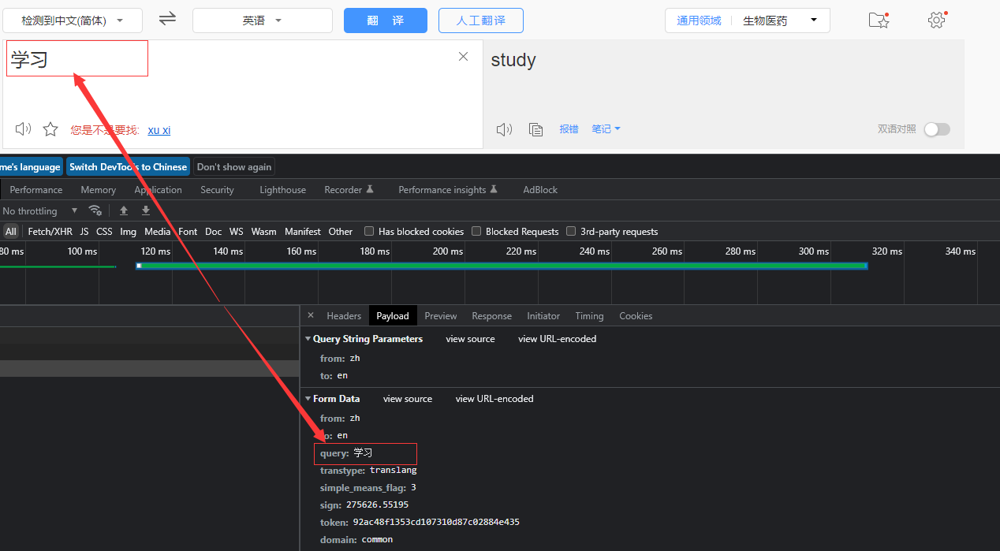
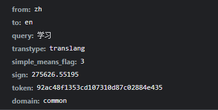
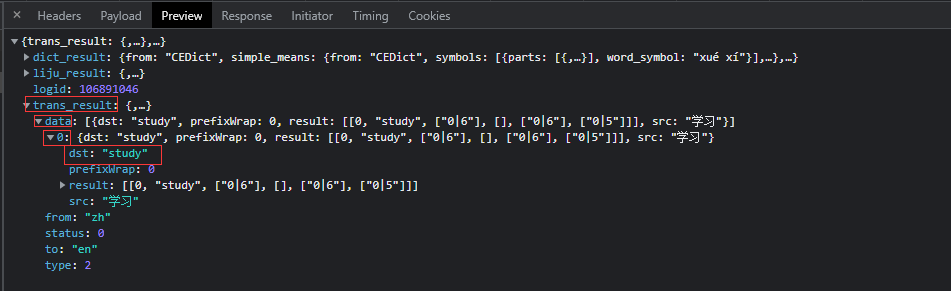
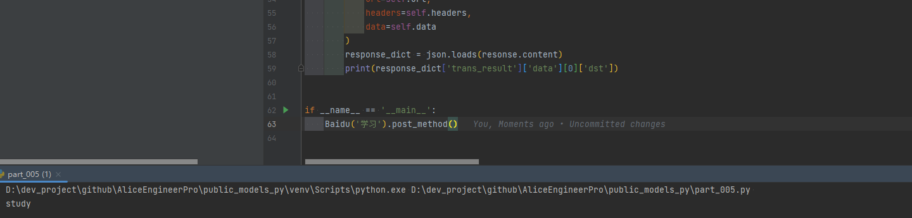

# requests模块发送POST请求

思考:

> 哪些地方我们会用到POST请求? 
>
> 1. 登录注册( 在web工程师看来POST 比 GET 更安全,url地址中不会暴露用户的账号密码等信息)
> 2. 需要传输大文本内容的时候( POST 请求对数据长度没有要求)
>
> 同样的,爬虫也需要在这两个地方回去模拟浏览器发送post请求

## 一. requests发送POST请求的方法

```python
response = requests.post(url, data)
```

`data`参数接收一个字典

requests模块发送post请求函数的其它参数和发送get请求的参数完全一致

## 二. POST请求练习

我们通过百度翻译的例子看看post请求如何使用：

- 地址: <https://fanyi.baidu.com/>

### 1. 思路分析

#### (1). 抓包确定请求的url地址

 

#### (2). 确定请求的参数

 

 

#### (3). 确定返回数据的位置

 

#### (4). 模拟浏览器获取数据

 

### 2. 代码实现

```python
# coding: utf8
""" 
@File: part_005.py
@Author: Alice(From Chengdu.China)
@HomePage: https://github.com/AliceEngineerPro
@CreatedTime: 2022/10/18 14:08
"""
import json
import os, sys

import requests
import time

"""POST请求百度翻译"""


class Baidu(object):
    """百度翻译"""

    def __init__(self, kword: str):
        self.kword = kword
        self.url = 'https://fanyi.baidu.com/v2transapi?from=zh&to=en'
        self.headers = {
            'User-Agent': 'Mozilla/5.0 (Windows NT 10.0; Win64; x64) AppleWebKit/537.36 (KHTML, like Gecko) Chrome/109.0.0.0 Safari/537.36',
            'Accept-Encoding': 'gzip, deflate',
            'Accept': '*/*',
            'Connection': 'keep-alive',
            'Cookie': 'BIDUPSID=E93ED0C7F32AF1EC82E2162EB9A8A484; PSTM=1665947571; BAIDUID=E93ED0C7F32AF1EC3957D4B927CFF46A:FG=1; BDORZ=B490B5EBF6F3CD402E515D22BCDA1598; BAIDUID_BFESS=E93ED0C7F32AF1EC3957D4B927CFF46A:FG=1; BA_HECTOR=212g0k20a50k8h0l810k63ct1hkr2so1b; ZFY=svKmEb:BlY8:B18U0E2nf9ELBy0WnWLV89X0rAEKvMFO4:C; APPGUIDE_10_0_2=1; REALTIME_TRANS_SWITCH=1; FANYI_WORD_SWITCH=1; HISTORY_SWITCH=1; SOUND_SPD_SWITCH=1; SOUND_PREFER_SWITCH=1; ab_sr=1.0.1_ZmNjNmUxNzljZmUyMWYzZTY3YTgwYzNjZGI4MDYwOTQwNzJmYTdhZTFjNWExN2ZjNzI1ODhmNWVjMmQ5NjBkZjZkY2EwOTkwNWJhOWExNzI2MGE4YWI4MmI0ODllMTQyMTU2MDExNTM4MDhhZjlkZWIyOWM2ZmRjNGY1NzRjMjM3MTU5ODU1YzZjZmJkOGU5YWI2NTc4NzBmMDQxMzRiNw==',
            'Host': 'fanyi.baidu.com',
            'Origin': 'https://fanyi.baidu.com',
            'Referer': 'https://fanyi.baidu.com/',
            'Acs-Token': '1665990292453_1666076505721_SdxK64OeDt7XdvwgQHb8tl2Lgj5Rdd+OTX0k8lMmmo1GltC4tRA43Co/N5kkWIwcoRFAvIUYxu5gwbc5+0cnt6Tw4tFHkOSNOmaEDuuLLQC2JInbNzEnT7izSYCfLmZAFETPkDUedn/F1QrFGaYc9ixWyemyQJadHAFDaZX8OeuDw3HncZGEisrW/yKtZICi5BGBo0mJeTbDsUPLO0gnAzJMrC+LW2n1XAZYvlte558+DyWzgS6ZHhoYJAIhR3tquKu8IqyLQwxdeVAU5+Iq8I17RiBpWqRGtSppOUB9QgRWB6oUsoD0oUQFTEzDanqZSus7E3n1G5ahATeq7fJf2A==',
            'sec-ch-ua': '"Not_A Brand";v="99", "Google Chrome";v="109", "Chromium";v="109"'
        }
        self.data = {
            # 'query': self.kword
            'from': 'zh',
            'to': 'en',
            'query': self.kword,
            'transtype': 'translang',
            'simple_means_flag': 3,
            'sign': '275626.55195',
            'token': '92ac48f1353cd107310d87c02884e435',
            'domain': 'common'
        }

    def get_method(self):
        pass

    def post_method(self):
        resonse = requests.post(
            url=self.url,
            headers=self.headers,
            data=self.data
        )
        response_dict = json.loads(resonse.content)
        print(response_dict['trans_result']['data'][0]['dst'])


if __name__ == '__main__':
    Baidu('学习').post_method()
```

