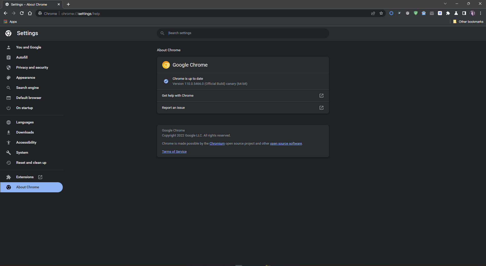
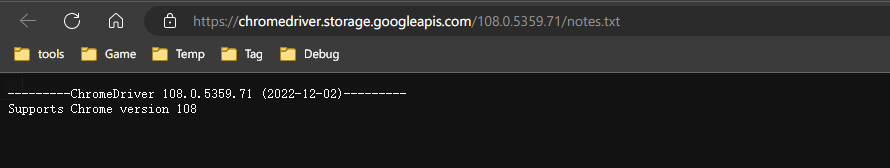
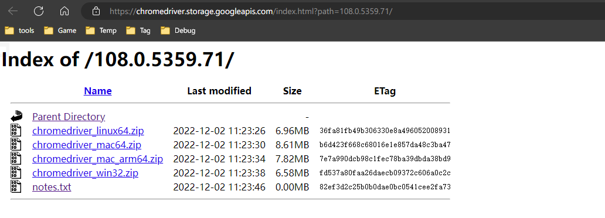

# selenium介绍

## 一. selenium运行效果展示

> Selenium是一个Web的自动化测试工具,最初是为网站自动化测试而开发的,Selenium 可以直接调用浏览器,它支持所有主流的浏览器(包括PhantomJS这些无界面的浏览器),可以接收指令,让浏览器自动加载页面,获取需要的数据,甚至页面截屏等。我们可以使用selenium很容易完成之前编写的爬虫,接下来我们就来看一下selenium的运行效果

### 1. chrome浏览器的运行效果

> 在下载好chromedriver以及安装好selenium模块后,执行下列代码并观察运行的过程

```python
# coding: utf8
""" 
@File: part_001.py
@Author: Alice(From Chengdu.China)
@HomePage: https://github.com/AliceEngineerPro
@CreatedTime: 2022/12/9 3:29
"""

from selenium import webdriver

# 如果driver没有添加到了环境变量，则需要将driver的绝对路径赋值给executable_path参数
webdriver.FirefoxOptions().binary_location = r'C:\Program Files\Mozilla Firefox\firefox.exe'
driver = webdriver.Firefox(executable_path=r'./driver/firefox_107_0_1_x86_64/win/geckodriver.exe')
# 如果driver添加了环境变量则不需要设置executable_path
# driver = webdriver.Firefox()

# 向一个url发起请求
driver.get('https://baidu.com')

# 打印页面的标题
print(driver.title)

# 退出模拟浏览器, 不退出会有残留进程！
driver.quit()

```

### 2. phantomjs无界面浏览器的运行效果

> PhantomJS 是一个基于Webkit的“无界面”(headless)浏览器，它会把网站加载到内存并执行页面上的 JavaScript。下载地址：http://phantomjs.org/download.html

```python
# coding: utf8
""" 
@File: part_002.py
@Author: Alice(From Chengdu.China)
@HomePage: https://github.com/AliceEngineerPro
@CreatedTime: 2022/12/9 3:32
"""

from selenium import webdriver
from selenium.webdriver.firefox.options import Options

options = Options()
options.add_argument(argument='-headless')
options.add_argument(argument='--disable-gpu')
driver = webdriver.Firefox(executable_path=r'./driver/firefox_107_0_1_x86_64/win/geckodriver.exe', options=options)
driver.get(url=r'https://baidu.com')
print(driver.page_source)
driver.quit()

```

### 3. 观察运行效果

python代码能够自动的调用谷歌浏览或phantomjs无界面浏览器，控制其自动访问网站

### 4. 无头浏览器与有头浏览器的使用场景

1. 通常在开发过程中我们需要查看运行过程中的各种情况所以通常使用有头浏览器
2. 在项目完成进行部署的时候，通常平台采用的系统都是服务器版的操作系统，服务器版的操作系统必须使用无头浏览器才能正常运行

## 二. selenium的作用和工作原理


- webdriver本质是一个web-server，对外提供webapi，其中封装了浏览器的各种功能
- 不同的浏览器使用各自不同的webdriver

## 三. selenium的安装以及简单使用

### 1. 安装selenium模块

```shell
pip install selenium==4.7.2
```

### 2. 下载版本符合的webdriver

> 以chrome谷歌浏览器为例

#### (1). 查看谷歌浏览器的版本



#### (2). [chromedriver下载](https://chromedriver.chromium.org/)

官方: [传送门](https://chromedriver.chromium.org/)

国内镜像: [传送门](https://registry.npmmirror.com/binary.html?path=chromedriver/)

#### (3). 查看chrome和chromedriver匹配的版本

`notes.txt`为说明文件



#### (4). 根据操作系统下载正确版本的chromedriver



#### (5). 解压压缩包

python可以调用的谷歌浏览器的webdriver可执行文件

- windows为`chromedriver.exe`
- linux和macos为`chromedriver`

#### (6). chromedriver环境的配置

- windows环境下需要将`chromedriver.exe`所在的目录设置为path环境变量中的路径
- linux/mac环境下，将`chromedriver`所在的目录设置到系统的PATH环境值中

## 四. selenium的简单使用

> 模拟百度搜索

示例代码:

```python
# coding: utf8
""" 
@File: part_003.py
@Author: Alice(From Chengdu.China)
@HomePage: https://github.com/AliceEngineerPro
@CreatedTime: 2022/12/9 4:51
"""

from selenium import webdriver
from selenium.webdriver.common.by import By
import time

webdriver.FirefoxOptions().binary_location = r'C:\Program Files\Mozilla Firefox\firefox.exe' 
driver = webdriver.Firefox(executable_path=r'./driver/firefox_107_0_1_x86_64/win/geckodriver.exe')
driver.get('https://baidu.com')
time.sleep(2)
driver.find_element(by=By.ID, value='kw').send_keys('python')
time.sleep(3)
driver.find_element(by=By.ID, value='su').click()
time.sleep(3)
print(driver.title)
driver.quit()

```

- `webdriver.FirefoxOptions().binary_location`是指定Firefox浏览器的执行文件路径
- `webdriver.Firefox(executable_path=r'./driver/firefox_107_0_1_x86_64/win/geckodriver.exe')`中`executable_path`参数是来指定driver路径
- `driver.find_element(by=By.ID, value='kw').send_keys('python')`中`find_element`方法是用来查找唯一的html元素, `By.ID`表示查询html元素属性ID为`kw`的html元素, `send_keys`表示输入字符
- `driver.find_element(by=By.ID, value='su').click()`中`click`方法用来出发js的click时事件
